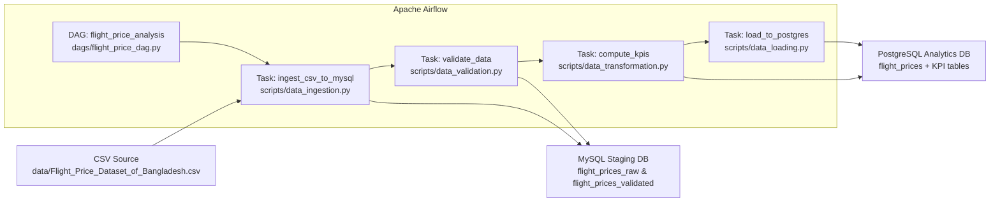

## Airflow Project: Flight Price Analysis

End-to-end data engineering project for analyzing Bangladesh flight prices using Apache Airflow, MySQL, PostgreSQL, and Python.  
The pipeline ingests raw CSV data, validates and transforms it, computes business KPIs, and loads the results into a PostgreSQL analytics database.

This project implements the requirements described in Module Lab:
- **Objective:** Build an Airflow‑orchestrated pipeline that ingests a Kaggle CSV dataset, validates and cleans the data, computes key KPIs, and stores the final results in PostgreSQL.
- **Pipeline stages:** Data ingestion → data validation → data transformation & KPI computation → loading into PostgreSQL.
- **Technologies:** Airflow, MySQL (staging), PostgreSQL (analytics), Python (Pandas), CSV source data.
- **Documentation:** The full pipeline report lives in `docs/pipeline_report.md`.

---

## Repository Structure

- `dags/`
  - `flight_price_dag.py` – Airflow DAG that orchestrates the full pipeline.
- `scripts/`
  - `data_ingestion.py` – Ingests CSV data into the MySQL staging database.
  - `data_validation.py` – Validates, cleans, and enhances the staging data.
  - `data_transformation.py` – Computes business KPIs and writes them to PostgreSQL.
  - `data_loading.py` – Loads validated data from MySQL into PostgreSQL.
- `data/`
  - `Flight_Price_Dataset_of_Bangladesh.csv` – Raw Kaggle dataset (CSV file source).
- `sql/`
  - `mysql_schema.sql` – Schema for the MySQL staging database.
  - `postgres_schema.sql` – Schema for the PostgreSQL analytics database.
- `docs/`
  - `pipeline_report.md` – Detailed report covering architecture, DAG/tasks, KPIs, validation rules, and challenges.
- `docker-compose.yml` – Spins up Airflow, MySQL, and PostgreSQL services with all volumes wired.
- `steps.md` – Miscellaneous notes / step‑by‑step guidance for the lab.

---

## Architecture Diagram (Code & Services)

The diagram below shows how the **code modules**, **Airflow DAG**, and **databases** interact.



For a higher‑level **data‑flow view**, see the additional mermaid diagram and narrative in `docs/pipeline_report.md`.

---

## Pipeline Overview (as required in Lab 3)

### 1. Data Ingestion (CSV → MySQL)

- **Input:** `data/Flight_Price_Dataset_of_Bangladesh.csv`
- **Script:** `scripts/data_ingestion.py` (`ingest_csv_to_mysql`)
- **Task in DAG:** `ingest_csv_to_mysql`
- **What it does:**
  - Reads all CSV files from `/opt/airflow/data` (mapped from local `data/`).
  - Renames columns to a standardized snake_case schema for MySQL.
  - Parses departure/arrival timestamps.
  - Loads combined data into MySQL table `flight_prices_raw`.

### 2. Data Validation (MySQL → MySQL)

- **Script:** `scripts/data_validation.py` (`validate_data`)
- **Task in DAG:** `validate_data`
- **Checks implemented (matching lab requirements):**
  - Ensures required columns exist: `airline`, `source`, `destination`, `base_fare_bdt`, `tax_surcharge_bdt`, `total_fare_bdt`.
  - Handles missing values:
    - Drops rows with null `airline`, `source`, or `destination`.
    - Fills missing base/tax fares with `0`.
  - Validates numeric types using `pd.to_numeric`.
  - Consistency checks: fares must be non‑negative and `total_fare_bdt ≥ base_fare_bdt`.
  - Adds a `is_peak_season` flag based on `seasonality` (e.g. Eid, Winter Holidays, Hajj).
- **Output:** Clean data written back to MySQL as `flight_prices_validated`.

### 3. Data Transformation & KPI Computation (MySQL → PostgreSQL)

- **Script:** `scripts/data_transformation.py` (`compute_kpis`)
- **Task in DAG:** `compute_kpis`
- **KPI metrics (as required in the lab):**
  - **Average Fare by Airline**  
    - Computes mean base fare, tax & surcharge, and total fare per airline, and booking count.  
    - Stored in PostgreSQL table `kpi_avg_fare_by_airline`.
  - **Seasonal Fare Variation**  
    - Groups by `seasonality` and `is_peak_season`, computing average/min/max fares and booking count.  
    - Stored in `kpi_seasonal_variation`.
  - **Most Popular Routes**  
    - Aggregates bookings by `source`/`destination`, plus readable route name and average fare.  
    - Returns top routes by booking count and writes them to `kpi_popular_routes`.
  - **Booking Count by Airline**  
    - Total bookings per airline plus class breakdown (Economy, Business, First Class).  
    - Stored in `kpi_booking_count_by_airline`.

### 4. Data Loading into PostgreSQL (MySQL → PostgreSQL)

- **Script:** `scripts/data_loading.py` (`load_to_postgres`)
- **Task in DAG:** `load_to_postgres`
- **What it does:**
  - Reads validated data from MySQL (`flight_prices_validated`).
  - Drops technical columns not needed on the analytics side (e.g. `id`, `validated_at`).
  - Loads the cleaned dataset into PostgreSQL table `flight_prices`.

---

## Airflow DAG: `flight_price_analysis`

Defined in `dags/flight_price_dag.py`:

- **Schedule:** `@daily`
- **Start date:** `2026-01-01`
- **Dependencies:**

```text
start → ingest_csv_to_mysql → validate_data → compute_kpis → load_to_postgres → end
```

Each task is a `PythonOperator` that calls the corresponding function from the scripts under `/opt/airflow/scripts`.

---

## Running the Project

### Prerequisites

- Docker and Docker Compose installed.
- (Optional but recommended) `.env` file with SMTP credentials for Airflow email alerts:
  - `SMTP_USER`
  - `SMTP_PASSWORD`
  - `SMTP_MAIL_FROM`

### 1. Start All Services

```bash
docker-compose up -d
```

This will start:
- Airflow webserver and scheduler
- Airflow metadata PostgreSQL (`postgres_airflow`)
- MySQL staging database (`mysql`)
- PostgreSQL analytics database (`postgres_analytics`)

### 2. Initialize Airflow (first run only)

If not already done, the `airflow-init` service will:
- Initialize the Airflow metadata DB.
- Create an `admin` user (`admin` / `admin`).

You can re‑run it manually if needed:

```bash
docker-compose run --rm airflow-init
```

### 3. Access Airflow UI

- URL: `http://localhost:8080`
- Username: `admin`
- Password: `admin`

In the UI:
1. Enable the `flight_price_analysis` DAG.
2. Click **Trigger DAG** to run the pipeline.

### 4. Verify Results in PostgreSQL Analytics

```bash
# Open a psql shell inside the analytics container
docker exec -it lab-3-postgres_analytics-1 psql -U analytics_user -d analytics

# Basic checks
SELECT COUNT(*) FROM flight_prices;
SELECT * FROM kpi_avg_fare_by_airline LIMIT 5;
SELECT * FROM kpi_popular_routes LIMIT 5;
```

---

## Validation Rules & Data Quality (Summary)

The validation layer (see `data_validation.py` and `docs/pipeline_report.md`) ensures:
- **Schema integrity:** All required columns exist; pipeline fails fast if they do not.
- **Null handling:** Critical dimensions (airline, source, destination) cannot be null; optional numeric fields are filled safely.
- **Type safety:** Numeric fare and duration columns are coerced to numeric, invalid values become `NaN` and are filtered out.
- **Business rules:** No negative fares and total fare must be at least the base fare.
- **Seasonality enrichment:** Adds a peak/non‑peak flag to support seasonal analysis.

---

## Additional Documentation & Future Work

For a deeper dive into:
- Detailed mermaid architecture diagram
- Exact SQL logic for each KPI
- Validation tables and rule descriptions
- Challenges and potential improvements

