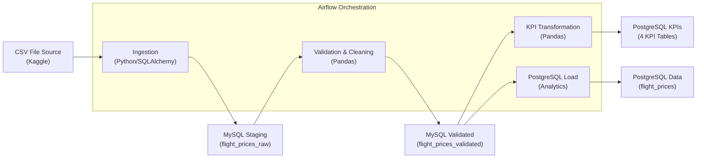

# Flight Price Analysis Pipeline

## Overview
This pipeline processes flight price data from Bangladesh through Airflow. Raw CSV data flows through MySQL staging tables before landing in PostgreSQL for analytics.

The pipeline uses hash-based duplicate detection to avoid reprocessing the same records. If no new data is found, it skips the validation/transformation steps and sends a notification email instead.

## Architecture



## Tech Stack
- Airflow for orchestration
- MySQL 8.0 for staging
- PostgreSQL 13 for analytics
- Python/Pandas for processing

## DAG Tasks

**DAG:** `flight_price_analysis` (manual trigger only, no schedule)

The DAG uses branching to optimize performance:

**Flow with new data:**
`start` → `ingest_csv_to_mysql` → `check_for_new_data` → `validate_data` → `compute_kpis` → `load_to_postgres` → `notify_success` → `end`

**Flow with no new data:**
`start` → `ingest_csv_to_mysql` → `check_for_new_data` → `notify_no_change` → `end`

### Task Details

1. **ingest_csv_to_mysql** 
   - Generates SHA-256 hash for each record (airline + source + destination + datetime + class + booking_source)
   - Compares against existing hashes in MySQL
   - Only inserts truly new records (UPSERT with ON DUPLICATE KEY)
   - Returns count of inserted rows via XCom

2. **check_for_new_data** (BranchPythonOperator)
   - Pulls row count from ingestion task
   - Branches to `validate_data` if count > 0
   - Branches to `notify_no_change` if count = 0

3. **validate_data** - Cleans data, handles nulls, removes bad records

4. **compute_kpis** - Calculates 4 KPIs and loads to PostgreSQL

5. **load_to_postgres** - Moves cleaned data from MySQL to PostgreSQL

6. **notify_success** - Sends email when new data is processed

7. **notify_no_change** - Sends email when no new data found

## KPIs Calculated

**Average Fare by Airline** (`kpi_avg_fare_by_airline`)
- Groups by airline and averages base fare, tax, and total fare

**Seasonal Variation** (`kpi_seasonal_variation`)
- Compares fares between peak seasons (Eid, Winter, Hajj) and regular periods
- Shows avg, min, max fares

**Popular Routes** (`kpi_popular_routes`)
- Top 20 routes by booking count
- Includes source/destination codes and names

**Bookings by Airline** (`kpi_booking_count_by_airline`)
- Total bookings per airline
- Breakdown by Economy, Business, First Class

## Validation Rules

- Generates SHA-256 hash from key fields to identify duplicates
- Drops rows missing airline, source, or destination
- Fills missing fare values with 0
- Recalculates total_fare if missing: `base_fare + tax_surcharge`
- Removes negative fares and invalid records where `total_fare < base_fare`

## Challenges Encountered & Solutions

### 1. Slow Pipeline Performance (~1:21 per run)
**Problem**: Pipeline took 1 minute 21 seconds even when no data changed.

**Solution**: Implemented incremental processing:
- Added SHA-256 hash generation for record deduplication
- Changed from `if_exists='replace'` to UPSERT logic
- Only process NEW records by comparing hashes against existing database

**Result**: Pipeline time reduced to ~48 seconds (40% improvement).

---

### 2. Row-by-Row Hash Generation Bottleneck
**Problem**: `df.apply(generate_hash, axis=1)` was extremely slow (~60 seconds for 57K rows).

**Solution**: Vectorized string concatenation:
```python
key_string = df['col1'] + '|' + df['col2'] + '|' + ...
df['hash'] = key_string.apply(lambda x: hashlib.sha256(x.encode()).hexdigest())
```
**Result**: Hash generation reduced to ~1 second.

---

### 3. Missing `record_hash` Column in Existing Tables
**Problem**: Tables created before incremental processing was added lacked the `record_hash` column, causing `Unknown column` errors.

**Solution**: Added migration logic to check and add missing columns:
```sql
IF NOT EXISTS (SELECT 1 FROM information_schema.columns WHERE column_name = 'record_hash')
THEN ALTER TABLE ADD COLUMN record_hash VARCHAR(64);
```

---

### 4. PostgreSQL Boolean Type Mismatch
**Problem**: MySQL stores booleans as `TINYINT(1)` (0/1), but PostgreSQL expects `TRUE`/`FALSE`. Insert failed with `column is of type boolean but expression is of type integer`.

**Solution**: Added explicit conversion before PostgreSQL insert:
```python
if 'is_peak_season' in df.columns:
    df['is_peak_season'] = df['is_peak_season'].apply(lambda x: bool(x) if x is not None else None)
```

---

### 5. Environment Variables Not Loaded in Docker
**Problem**: Email recipient was empty in container (`['']`).

**Solution**: Added `env_file` directive to docker-compose.yml:
```yaml
x-airflow-common:
  env_file:
    - .env
  environment:
    - TO_USER_EMAIL_1=${TO_USER_EMAIL_1}
```

---

### 6. DAG Column Mismatch Between Tables
**Problem**: Validation insert was including `created_at` and `updated_at` columns from raw table, which don't exist in validated table.

**Solution**: Explicitly defined valid columns for each target table instead of using all DataFrame columns.

---

### 7. ShortCircuitOperator Skipping Notification
**Problem**: When using `ShortCircuitOperator` for no-data scenarios, the notification task was also getting skipped.

**Solution**: Replaced with `BranchPythonOperator` to create explicit paths:
- Path 1: New data → full processing → success email
- Path 2: No change → skip processing → no-change email

---

### 8. NaN Values Causing SQL Errors
**Problem**: CSV with missing numeric values caused `Unknown column 'nan'` error because pandas NaN was converted to string "nan" instead of NULL.

**Solution**: Added explicit NaN check before SQL conversion:
```python
elif isinstance(val, float) and (val != val):  # NaN != NaN is True
    escaped_values.append('NULL')
```

---

### 9. Wasted Processing on Unchanged Data
**Problem**: Full pipeline ran even when CSV data hadn't changed.

**Solution**: Added branching logic so DAG skips validation/transformation/loading if ingestion finds zero new records. Separate email notifications for each scenario.

## Running It

```bash
docker-compose up -d
```

Set email recipient in `.env`:
```
TO_USER_EMAIL_1=your.email@example.com
```

Airflow UI: http://localhost:8080 (admin/admin)

The DAG must be manually triggered (no automatic schedule).

Check results in PostgreSQL analytics database.