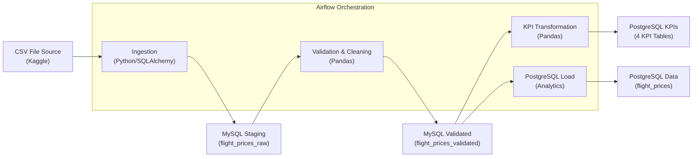

# Flight Price Analysis Pipeline

## Overview
This pipeline processes flight price data from Bangladesh through Airflow. Raw CSV data flows through MySQL staging tables before landing in PostgreSQL for analytics.

The pipeline uses hash-based duplicate detection to avoid reprocessing the same records. If no new data is found, it skips the validation/transformation steps and sends a notification email instead.

## Architecture



## Tech Stack
- Airflow for orchestration
- MySQL 8.0 for staging
- PostgreSQL 13 for analytics
- Python/Pandas for processing

## DAG Tasks

**DAG:** `flight_price_analysis` (manual trigger only, no schedule)

The DAG uses branching to optimize performance:

**Flow with new data:**
`start` → `ingest_csv_to_mysql` → `check_for_new_data` → `validate_data` → `compute_kpis` → `load_to_postgres` → `notify_success` → `end`

**Flow with no new data:**
`start` → `ingest_csv_to_mysql` → `check_for_new_data` → `notify_no_change` → `end`

### Task Details

1. **ingest_csv_to_mysql** 
   - Generates SHA-256 hash for each record (airline + source + destination + datetime + class + booking_source)
   - Compares against existing hashes in MySQL
   - Only inserts truly new records (UPSERT with ON DUPLICATE KEY)
   - Returns count of inserted rows via XCom

2. **check_for_new_data** (BranchPythonOperator)
   - Pulls row count from ingestion task
   - Branches to `validate_data` if count > 0
   - Branches to `notify_no_change` if count = 0

3. **validate_data** - Cleans data, handles nulls, removes bad records

4. **compute_kpis** - Calculates 4 KPIs and loads to PostgreSQL

5. **load_to_postgres** - Moves cleaned data from MySQL to PostgreSQL

6. **notify_success** - Sends email when new data is processed

7. **notify_no_change** - Sends email when no new data found

## KPIs Calculated

**Average Fare by Airline** (`kpi_avg_fare_by_airline`)
- Groups by airline and averages base fare, tax, and total fare

**Seasonal Variation** (`kpi_seasonal_variation`)
- Compares fares between peak seasons (Eid, Winter, Hajj) and regular periods
- Shows avg, min, max fares

**Popular Routes** (`kpi_popular_routes`)
- Top 20 routes by booking count
- Includes source/destination codes and names

**Bookings by Airline** (`kpi_booking_count_by_airline`)
- Total bookings per airline
- Breakdown by Economy, Business, First Class

## Validation Rules

- Generates SHA-256 hash from key fields to identify duplicates
- Drops rows missing airline, source, or destination
- Fills missing fare values with 0
- Recalculates total_fare if missing: `base_fare + tax_surcharge`
- Removes negative fares and invalid records where `total_fare < base_fare`

## Issues Encountered

**Avoiding duplicate processing** - Initially the pipeline would reprocess all CSV data every run. Added hash-based duplicate detection using SHA-256 of key fields. Now only new records trigger the full pipeline.

**Wasted processing on unchanged data** - Added branching logic so the DAG skips validation/transformation/loading if ingestion finds zero new records.

**Missing total fares** - Some records had base and tax but no total. Fixed by adding them together in validation.

**Cross-database transfers** - Used SQLAlchemy to read from MySQL and write to PostgreSQL with Pandas dataframes.

**Email notifications** - Added email alerts for both success and no-change scenarios. Configured via environment variable `TO_USER_EMAIL_1`.

## Running It

```bash
docker-compose up -d
```

Set email recipient in `.env`:
```
TO_USER_EMAIL_1=your.email@example.com
```

Airflow UI: http://localhost:8080 (admin/admin)

The DAG must be manually triggered (no automatic schedule).

Check results in PostgreSQL analytics database.