# Flight Price Analysis Pipeline Report

## 1. Overview

This document provides a comprehensive report on the Flight Price Analysis data pipeline built using Apache Airflow. The pipeline processes flight price data from Bangladesh to compute key business metrics.

---

## 2. Pipeline Architecture

```mermaid
flowchart LR
    A["📄 CSV File<br/>57,000+ rows"] --> B["🐬 MySQL<br/>(Staging)"]
    B --> C["✅ Validation"]
    C --> D["🔄 Transform<br/>& KPIs"]
    D --> E["🐘 PostgreSQL<br/>(Analytics)"]
    
    style A fill:#e1f5fe
    style B fill:#fff3e0
    style C fill:#e8f5e9
    style D fill:#f3e5f5
    style E fill:#e3f2fd
```



### Technology Stack

| Component | Technology | Purpose |
|-----------|------------|---------|
| Orchestration | Apache Airflow 2.7.0 | Workflow scheduling and monitoring |
| Staging Database | MySQL 8.0 | Store raw and validated data |
| Analytics Database | PostgreSQL 13 | Store processed data and KPIs |
| Processing | Python 3 + Pandas | Data manipulation and KPI computation |

---

## 3. DAG/Task Descriptions

### Airflow DAG: `flight_price_analysis`

```
start → ingest_csv_to_mysql → validate_data → compute_kpis → load_to_postgres → end
```

| Task ID | Description | Input | Output |
|---------|-------------|-------|--------|
| `ingest_csv_to_mysql` | Loads raw CSV data into MySQL staging | CSV file | `flight_prices_raw` table |
| `validate_data` | Validates columns, handles nulls, checks consistency | Raw table | `flight_prices_validated` table |
| `compute_kpis` | Calculates 4 business KPIs | Validated table | 4 KPI tables in PostgreSQL |
| `load_to_postgres` | Transfers clean data to analytics DB | Validated table | `flight_prices` table in PostgreSQL |

---

## 4. KPI Definitions and Computation Logic

### KPI 1: Average Fare by Airline

**Purpose:** Compare pricing strategies across different airlines

**Formula:**
```sql
SELECT 
    airline,
    AVG(base_fare_bdt) as avg_base_fare,
    AVG(tax_surcharge_bdt) as avg_tax_surcharge,
    AVG(total_fare_bdt) as avg_total_fare,
    COUNT(*) as booking_count
FROM flight_prices_validated
GROUP BY airline
```

**Business Value:** Identifies premium vs budget carriers

---

### KPI 2: Seasonal Fare Variation

**Purpose:** Understand price fluctuations during peak travel seasons

**Peak Seasons Defined:**
- Eid (Eid-ul-Fitr and Eid-ul-Adha)
- Winter Holidays (December - January)
- Hajj season

**Formula:**
```sql
SELECT 
    seasonality,
    is_peak_season,
    AVG(total_fare_bdt) as avg_fare,
    MIN(total_fare_bdt) as min_fare,
    MAX(total_fare_bdt) as max_fare,
    COUNT(*) as booking_count
FROM flight_prices_validated
GROUP BY seasonality, is_peak_season
```

**Business Value:** Enables dynamic pricing strategies

---

### KPI 3: Popular Routes

**Purpose:** Identify highest-demand source-destination pairs

**Formula:**
```sql
SELECT 
    source,
    destination,
    COUNT(*) as booking_count,
    AVG(total_fare_bdt) as avg_fare
FROM flight_prices_validated
GROUP BY source, destination
ORDER BY booking_count DESC
LIMIT 20
```

**Business Value:** Guides route expansion and capacity planning

---

### KPI 4: Booking Count by Airline

**Purpose:** Analyze market share and class distribution

**Formula:**
```sql
SELECT 
    airline,
    COUNT(*) as total_bookings,
    SUM(CASE WHEN class = 'Economy' THEN 1 ELSE 0 END) as economy_bookings,
    SUM(CASE WHEN class = 'Business' THEN 1 ELSE 0 END) as business_bookings,
    SUM(CASE WHEN class = 'First Class' THEN 1 ELSE 0 END) as first_class_bookings
FROM flight_prices_validated
GROUP BY airline
```

**Business Value:** Competitive analysis and service planning

---

## 5. Data Validation Rules

| Check | Rule | Action on Failure |
|-------|------|-------------------|
| Required Columns | `airline`, `source`, `destination`, `base_fare_bdt`, `tax_surcharge_bdt`, `total_fare_bdt` must exist | Fail pipeline |
| Null Handling | Drop rows with null airline/source/destination | Remove row |
| Fare Validation | All fare values must be ≥ 0 | Remove row |
| Consistency | `total_fare_bdt` ≥ `base_fare_bdt` | Remove row |
| Type Validation | Fare columns must be numeric | Coerce or remove |

---

## 6. Challenges and Solutions

| Challenge | Solution |
|-----------|----------|
| **Large dataset (57K+ rows)** | Implemented chunked loading with 5000 rows per batch |
| **Column name mismatches** | Created column mapping dictionary in ingestion script |
| **Missing/null values** | Implemented smart handling: drop for required fields, fill for optional |
| **Database connectivity** | Used SQLAlchemy for consistent database connections |
| **Peak season detection** | Created lookup list of Bangladesh peak travel seasons |
| **Data type inconsistencies** | Used `pd.to_numeric()` with `errors='coerce'` for safe conversion |

---

## 7. How to Run the Pipeline

### Step 1: Start Docker Services
```bash
docker-compose up -d
```

### Step 2: Access Airflow UI
- URL: http://localhost:8080
- Username: `admin`
- Password: `admin`

### Step 3: Trigger DAG
1. Enable the `flight_price_analysis` DAG
2. Click "Trigger DAG" button

### Step 4: Verify Results
```bash
# Connect to PostgreSQL analytics database
docker exec -it lab-3-postgres_analytics-1 psql -U analytics_user -d analytics

# Check data
SELECT COUNT(*) FROM flight_prices;
SELECT * FROM kpi_avg_fare_by_airline LIMIT 5;
```

---

## 8. Future Improvements

1. **Add data quality checks** using Great Expectations
2. **Implement incremental loading** instead of full refresh
3. **Add email alerts** for pipeline failures
4. **Create dashboard** using Apache Superset or Metabase
5. **Add more KPIs** like price prediction models

---

*Report generated for Lab 3: Airflow Project - Flight Price Analysis*
