# Flight Price Analysis Pipeline Report (Module Lab 3)

## 1. Overview
This report details the implementation of an end-to-end data engineering pipeline for analyzing flight price data in Bangladesh. The pipeline is orchestrated by Apache Airflow and manages data flow from a raw CSV source to a PostgreSQL analytics database via a MySQL staging layer.

---

## 2. Pipeline Architecture

The architecture follows a classic staging and analytics pattern to ensure data quality and separation of concerns.

```mermaid
flowchart LR
    CSV["📄 CSV File Source<br/>(Kaggle)"] --> INGEST["📥 Ingestion<br/>(Python/SQLAlchemy)"]
    INGEST --> MYSQL_RAW["🐬 MySQL Staging<br/>(flight_prices_raw)"]
    MYSQL_RAW --> VALIDATE["✅ Validation & Cleaning<br/>(Pandas)"]
    VALIDATE --> MYSQL_VAL["🐬 MySQL Validated<br/>(flight_prices_validated)"]
    MYSQL_VAL --> TRANSFORM["🔄 KPI Transformation<br/>(Pandas)"]
    MYSQL_VAL --> LOAD["🐘 PostgreSQL Load<br/>(Analytics)"]
    TRANSFORM --> PG_KPI["🐘 PostgreSQL KPIs<br/>(4 KPI Tables)"]
    LOAD --> PG_FINAL["🐘 PostgreSQL Data<br/>(flight_prices)"]
    
    subgraph Airflow["Airflow Orchestration"]
        INGEST
        VALIDATE
        TRANSFORM
        LOAD
    end
```



### Technology Stack
| Component | Technology | Role |
|-----------|------------|------|
| **Orchestration** | Apache Airflow | Workflow scheduling, error handling, and task dependency management. |
| **Staging DB** | MySQL 8.0 | High-speed ingestion and storage of raw and validated intermediate data. |
| **Analytics DB** | PostgreSQL 13 | Final destination for business-ready data and computed KPIs. |
| **Processing** | Python 3 + Pandas | Data cleaning, type coercion, and metric aggregation. |
| **Connectivity** | SQLAlchemy | Unified database abstraction for cross-DB data transfers. |

---

## 3. Airflow DAG & Task Descriptions

### DAG ID: `flight_price_analysis`
- **Schedule:** `@daily`
- **Execution Flow:** `start` → `ingest_csv_to_mysql` → `validate_data` → `compute_kpis` → `load_to_postgres` → `end`

| Task ID | Component | Description |
|---------|-----------|-------------|
| `ingest_csv_to_mysql` | Ingestion | Reads `data/Flight_Price_Dataset_of_Bangladesh.csv`, standardizes column names to `snake_case`, and loads into `flight_prices_raw`. |
| `validate_data` | Validation | Implements incremental validation using SHA-256 record hashing. Filters duplicates, handles nulls, and calculates missing fares. |
| `compute_kpis` | Transformation | Aggregates the validated data into 4 specific business KPI tables in PostgreSQL. |
| `load_to_postgres` | Loading | Performs the final transfer of cleaned flight records from the MySQL staging environment to the PostgreSQL analytics database. |

---

## 4. KPI Definitions and Computation Logic

### KPI 1: Average Fare by Airline
- **Logic:** Groups records by `airline` to calculate the mean of `base_fare`, `tax_surcharge`, and `total_fare`.
- **Table:** `kpi_avg_fare_by_airline`
- **Business Value:** Provides insights into the pricing positioning of carriers.

### KPI 2: Seasonal Fare Variation
- **Logic:** Groups data by `seasonality` and the enriched `is_peak_season` flag.
- **Table:** `kpi_seasonal_variation`
- **Peak Seasons:** Defined as *Eid*, *Winter Holidays*, and *Hajj*.
- **Metrics:** Average, Minimum, and Maximum total fares per season.

### KPI 3: Most Popular Routes
- **Logic:** Identifies the top 20 source-destination pairs based on booking count.
- **Table:** `kpi_popular_routes`
- **Enrichment:** Includes both IATA codes (e.g., DAC) and human-readable names.

### KPI 4: Booking Count by Airline
- **Logic:** Aggregates total bookings and provides a pivot-like breakdown of counts for *Economy*, *Business*, and *First Class*.
- **Table:** `kpi_booking_count_by_airline`

---

## 5. Data Validation & Business Rules

| Rule Category | Implementation Detail |
|---------------|-----------------------|
| **Required Fields** | Drops records missing `airline`, `source`, or `destination`. |
| **Missing Fares** | If `total_fare` is 0 or NULL, it is recalculated as `base_fare + tax_surcharge`. |
| **Type Safety** | Uses `pd.to_numeric(errors='coerce')` for all fare and duration columns. |
| **Consistency** | Records are removed if `total_fare < base_fare` or if any fare is negative. |
| **Idempotency** | Uses SHA-256 hashing of key fields to ensure the same record is never validated or loaded twice (Incremental Logic). |

---

## 6. Challenges and Solutions

1.  **Duplicate Data:**
    - *Challenge:* The raw dataset might contain duplicate records or be re-ingested.
    - *Solution:* Implemented a hashing mechanism (`record_hash`) and `INSERT IGNORE` logic in MySQL to ensure only new records are processed.
2.  **Missing Total Fares:**
    - *Challenge:* Some records provided individual components but lacked the total.
    - *Solution:* Added a dynamic recalculation step in the validation script: `total = base + tax`.
3.  **Cross-Database Migration:**
    - *Challenge:* Moving data between MySQL (Staging) and PostgreSQL (Analytics).
    - *Solution:* Leveraged SQLAlchemy engines to read from one and write to the other seamlessly via Pandas dataframes.

---

## 7. Execution Guide

1.  **Deployment:** Run `docker-compose up -d` to spin up the infrastructure.
2.  **Orchestration:** Access the Airflow UI at `localhost:8080` (admin/admin).
3.  **Validation:** Monitor the task logs for timing metrics (e.g., `⏱️ STEP 5 - Validation checks`).
4.  **Analytics:** Query the results in PostgreSQL:
    ```sql
    SELECT * FROM kpi_seasonal_variation ORDER BY avg_total_fare DESC;
    ```

---
*Generated for Lab 3: Flight Price Analysis Pipeline*